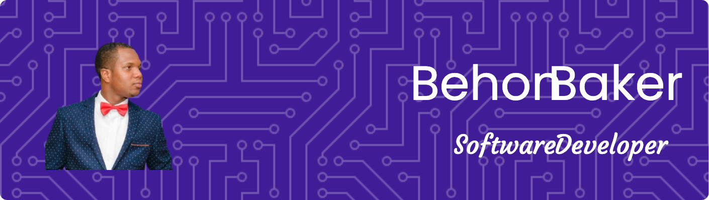

# 💫 Who? Me?
👋 Hi, I'm Behon Baker, a seasoned Software Developer with over 10 years of experience specializing in crafting scalable SaaS products. I thrive on developing web applications that address the needs of large companies, particularly those still operating with manual processes. I love automating workflows and transforming pen-and-paper operations into efficient, technology-driven solutions. My tech stack includes JavaScript, TypeScript, C#, and Python, with expertise in Vue.js, Nuxt.js, Tailwind CSS, Node.js, Express.js, and more. Currently, I'm deeply engaged in building dynamic user interfaces, robust backends, and optimizing data storage. Explore my coding journey on GitHub, and let's connect on LinkedIn for a tech chat or potential collaboration. Happy coding! 

### Where to find me
     

### Stuff I have used before
                                                    

###  GitHub stats:
 
 

### GitHub Trophies

### ✍️ Random Dev Quote

### 😂 Random Dev Meme

---

  ## 💰 You can help me by Donating
     

  
<!-- Proudly created with GPRM ( https://gprm.itsvg.in ) -->
